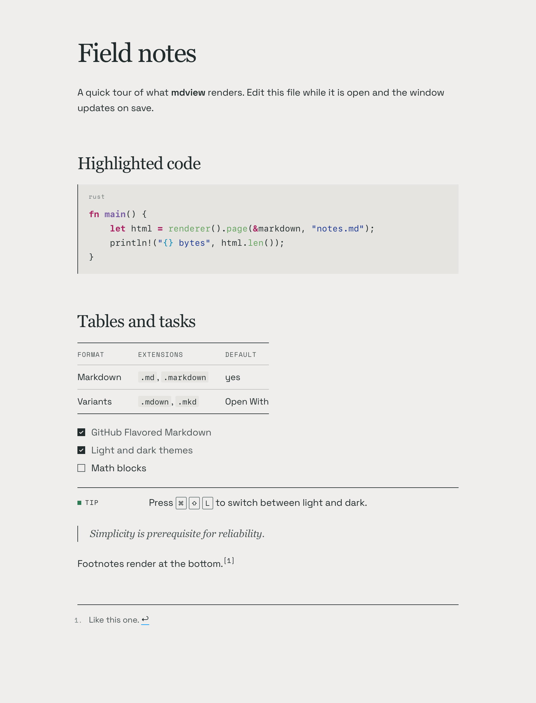
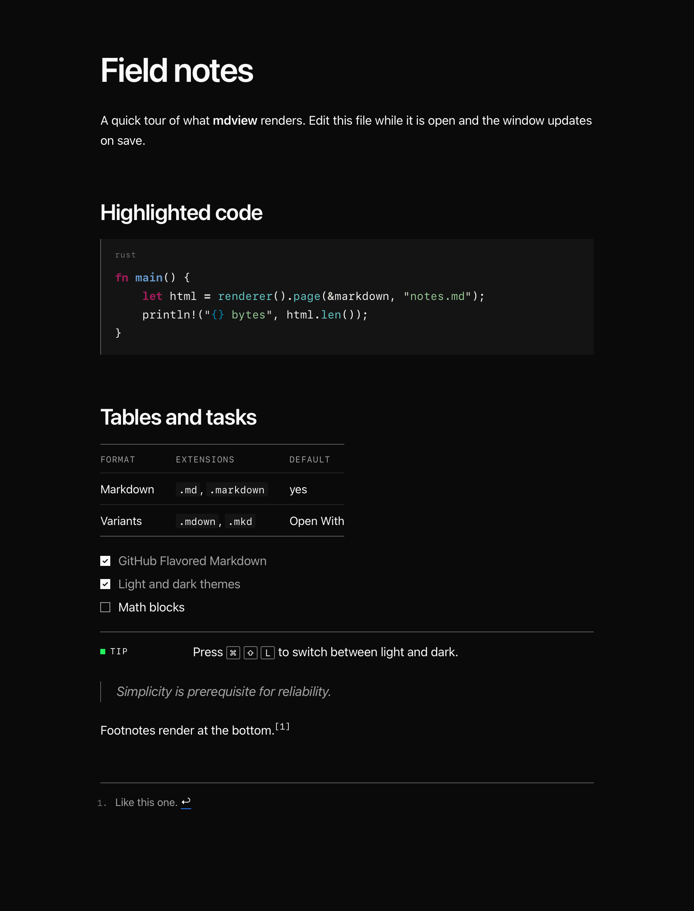
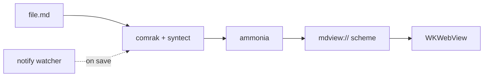

<div align="center">


# mdview

**A fast, native Markdown viewer for macOS.**

Rust renders the document and the system WebKit view displays it.<br>
No Electron, no bundled browser, about 3 MB.


</div>

<table>
<tr>
<td></td>
<td></td>
</tr>
</table>

## Why

Opening a README should take as long as opening a text file. mdview starts in a blink, opens `.md` files from Finder by double-click, and redraws as you save.

## Features

- **GitHub Flavored Markdown.** Tables, task lists, strikethrough, autolinks, footnotes, alerts and front matter, parsed by [comrak](https://github.com/kivikakk/comrak).
- **Syntax highlighting.** Code blocks are highlighted by [syntect](https://github.com/trishume/syntect) with matching light and dark themes.
- **Live reload.** Saving in any editor updates the window and keeps your scroll position.
- **Relative links and images.** Linked Markdown files open in the same window, with back and forward. Web links open in your browser.
- **Safe raw HTML.** Centered logos, `<details>` and badges survive. Scripts and event handlers are stripped by [ammonia](https://github.com/rust-ammonia/ammonia), and a Content Security Policy blocks the rest.
- **Two themes, one shortcut.** Light uses Georgia headings, Space Grotesk body text and Space Mono labels on warm stone. Dark is neutral near-black with tight system type. Press <kbd>⌘</kbd> <kbd>⇧</kbd> <kbd>L</kbd> to flip between them, or pick Match System, Light or Dark under View › Appearance. The choice is remembered.
- **Print-style layout.** Callouts, tables, quotes and code use rules and margin labels instead of rounded cards.
- **Native app behavior.** Proxy icon in the title bar, Dock recents, find in page, zoom and print.

## Install

Requires Rust and the Xcode command line tools.

```sh
git clone https://github.com/4thel00z/mdview
cd mdview
make install
```

`make install` builds a release bundle and copies it to `~/Applications`. It registers the app with Launch Services and sets it as the default viewer for `.md` and `.markdown`. Use `MDVIEW_INSTALL_DIR=/Applications make install` to install for all users.

## Usage

Double-click any Markdown file, or use the terminal:

```sh
open README.md
alias mdview=~/Applications/mdview.app/Contents/MacOS/mdview
mdview notes.md todo.md
mdview --render README.md > README.html
```

| Action | Shortcut |
|---|---|
| Open | <kbd>⌘</kbd> <kbd>O</kbd> |
| Find, next, previous | <kbd>⌘</kbd> <kbd>F</kbd> · <kbd>⌘</kbd> <kbd>G</kbd> · <kbd>⇧</kbd> <kbd>⌘</kbd> <kbd>G</kbd> |
| Toggle light and dark | <kbd>⌘</kbd> <kbd>⇧</kbd> <kbd>L</kbd> |
| Reload | <kbd>⌘</kbd> <kbd>R</kbd> |
| Zoom in, out, reset | <kbd>⌘</kbd> <kbd>=</kbd> · <kbd>⌘</kbd> <kbd>-</kbd> · <kbd>⌘</kbd> <kbd>0</kbd> |
| Back, forward | <kbd>⌘</kbd> <kbd>[</kbd> · <kbd>⌘</kbd> <kbd>]</kbd> |
| Reveal in Finder | <kbd>⇧</kbd> <kbd>⌘</kbd> <kbd>R</kbd> |
| Print | <kbd>⌘</kbd> <kbd>P</kbd> |

## How it works



1. [tao](https://github.com/tauri-apps/tao) runs the event loop and receives Finder open events. [muda](https://github.com/tauri-apps/muda) builds the native menu bar.
2. [wry](https://github.com/tauri-apps/wry) hosts WKWebView and serves the page and its relative assets through a custom `mdview://` scheme.
3. Saving the file triggers a re-render, and only the page body is replaced, so the scroll position stays put.

## Development

```sh
make test      # unit tests and clippy with warnings as errors
make app       # build dist/mdview.app
make default   # re-apply the default handler for .md and .markdown
```

| Path | Purpose |
|---|---|
| `src/render.rs` | Markdown to sanitized HTML, themes |
| `src/protocol.rs` | `mdview://` scheme, embedded fonts |
| `src/app.rs` | Windows, live reload, menu actions |
| `src/appearance.rs` | Light, dark and system appearance, saved choice |
| `bundle/Info.plist` | Document types and imported Markdown type |
| `scripts/` | Bundling, icon, install and default handler |

## License

MIT. Space Grotesk and Space Mono are bundled under the SIL Open Font License; see `src/assets/fonts`.
